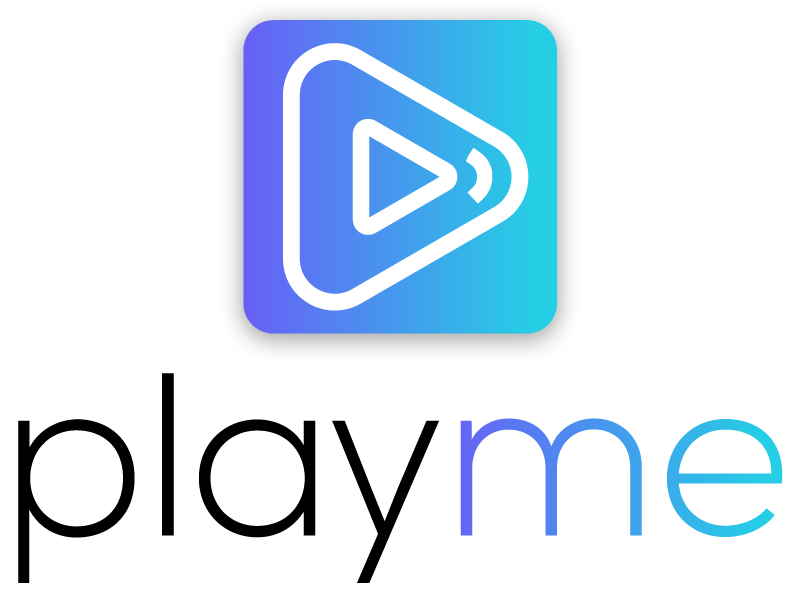

PlayMe is an unofficial YouTube Music desktop app with some additional tweaks on top. 

Why? So that you can enjoy your YouTube Music on desktop, without having to worry about the browser tab which plays it.

How does it work?
---------
It's a basic Electron WebView with Youtube Music. on top of that, additional system functionalities were added. The idea is not to use the Youtube API, but instead, to re-use the original youtube music functionality. 

Features:
---------
* Handle Media Keys: Play/Pause, Next, Previous
* Responsive Window

Install:
--------

*macOS 10.9+, Linux, and Windows 7+ are supported*

Download the latest version on the [website](http://playme.filip.engineer) or below.

### macOS

[**Download**](https://github.com/filipuic/playme/releases/latest) the `.dmg` file.

### Linux

[**Download**](https://github.com/filipuic/playme/releases/latest) the `.AppImage` file.

*The AppImage needs to be [made executable](http://discourse.appimage.org/t/how-to-make-an-appimage-executable/80) after download.*

### Windows

[**Download**](https://github.com/filipuic/playme/releases/latest) the `.exe` file.

Future Plans:
----------
- [ ] track player starts
- [ ] create & set an icon
- [ ] display system tray icon & allow basic controls from there
- [ ] display current song & current playlist in system tray
- [ ] display notification on song changed (if window not visible)
- [ ] seek while holding forward/backward media controls button
- [ ] implement preferences
- [ ] start on launch
- [ ] customizable global shortcuts
- [ ] set up automatic updates delivery
- [ ] create a landing page
- [ ] suggestions? 

Contributing:
----------

Thank you for deciding to contribute! In order to keep it clean & mainainable long term, we'd prefer to follow some good git practices.

1. Fork the repo
2. Create a local brach off `develop` (usually) named as following: `issue-number/1-3-keywords`
3. Make the changes
4. Follow the  for your commit title(s).
4. Rebase & clean up commit history (or leave it as it is, but we'll `squash & merge`)
5. Push the branch to your own fork
6. Create a Pull Request from your fork to this repo
7. Name the PR using the `message` used in commit, which follows the Commit Guidelines 
