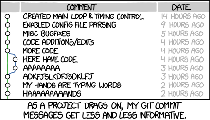

Commit Guidelines
=============

These are guidelines over how git commit messages should be formatted.

As a result, it would lead to more readable commit messages that are easy to follow when looking through the project history.

"A proper, well written git log is an important indicator for how well thought out a project is."



Commit Message Format
--------------------
	
Each commit message has a special format that includes an `issue ID`, a `scope` and a `subject`:

```
<issue-id>(<scope>):<subject>
```

Any line of the commit message title should not be longer than *70 characters*. This allows the message to be easier to read on GitHub as well as in various git tools. 

If you need more than 70 characters, please leave an empty line and continue adding more details. While writing the description, also try to limit to 72 characters per line, so that it looks properly in various git tools as well. 

If you are using *Sourcetree* you can add a margin line at 70/72 characters by going to Preferences → Commit → Use fixed-width font for commit messages and Preferences → Commit → Display column guide in commit message at character.

Issue ID
---------

Issue ID contains the issue number this commit is related to.

* If commit is not related to any issue, then either create it, or skip writing the ticket number.
* Avoid having more than one ticket per commit (there are exceptions though).

Note: if there is no ticket related to your commit, then please tend to create one. 

Scope
-------

The scope could be anything specifying place of the commit change.

For example: player, analytics, preferences, state, tray, controls etc.

The scope is optional, but it is highly recommended to write it.

* use `*` when the change affects more than a single scope.
* don't write a too specific scope like player-controls, menu-icons etc. nor too generic like icons, animations, list etc.
* tend to use only one word, but if you have to use two words, then use the camelCase notation
* don't use spaces

Subject
--------
The subject contains succinct description of the change:

* A properly formed git commit subject line should always be able to complete the following sentence: *If applied, this commit will <your subject line here>*
* use the imperative, present tense: *change* not ~~changed~~ nor ~~changes~~
* don't capitalize first letter
* don't capitalize letters unless very necessary
* no dot (.) at the end
* no space at the beginning of subject
* try to avoid generic words like "YouTube", "Android" which are obvious in the context of this app, and do not add necessary information for a commit message
* If it seems difficult to summarize what your commit does, it may be because it includes several logical changes or bug fixes, and are better split up into several commits using git add -p.
* tend not to use generic words like: ~~fix the player~~ doesn't give any information on what was changed. Be specific on what exactly fixed the problem. 
	For example: 
	 * add ability to set custom shortcuts
	 * save player state when app is closed

Information in subject

* Describe why a change is being made.
* How does it address the issue?
* What effects does the patch have?
* Do not assume the reviewer understands what the original problem was.
* Do not assume the code is self-evident/self-documenting.
* Read the commit message to see if it hints at improved code structure.
* The first commit line is the most important
* Do not write stories in multiple lines explaining why something is necessary, we have issues for that; so don't go too specifc. Try to be succint but straight to the point. 

Commit examples:
--------

Consider the following *bad examples* of commit messages:
* #200(player):fix crash when starting 
	* generic word fix, not explaining what was the issue or how it was solved, doesn't give any context on solution
* ...

*Good examples*:
* #10(settings):safely store/receive saved preferences
* #201(player):implement ability to repeat current song


